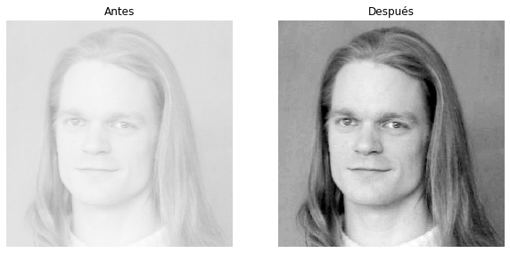
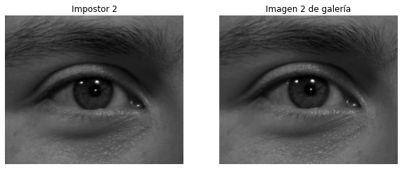
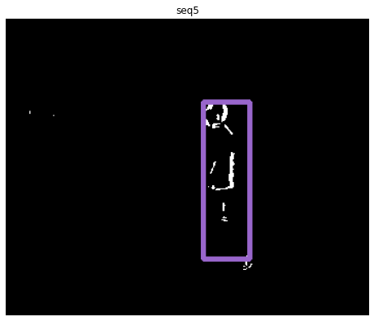

# Laboratorio de Inteligencia computacional y robótica 
Integrantes : Joaquin Zepeda, Benjamin Irarrazabal  

## Unidad 1: Procesamiento de imágenes
Profesor: Claudio Pérez F.
Auxiliar: Juan Pablo Pérez 

### Software and Libraries
   Opción 1: Usar el entorno gratuito de Google Colab  
   Opción 2: Python 3.6 Jupyter notebook   
   numpy   1.20.1  
   opencv-python  4.5.3.56 (pip install opencv-python)
   matplotlib    3.3.4  

### Experiencia 1: Filtros en imágenes, estiramientos, histogramas, segmentación de objetos/colores, entre otros.

 

  
 

### Experiencia 2: Algoritmo de análisis de textura LBP 

 

  
 

### Experiencia 3: 
#### Detección de movimiento con diferencia de frames y modelo de fondo 

 

  
 

#### Tracking de personas basado en Deep Learning usando la red neuronal convolucional entrenada con la base de datos MS-COCO

